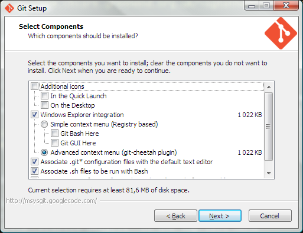
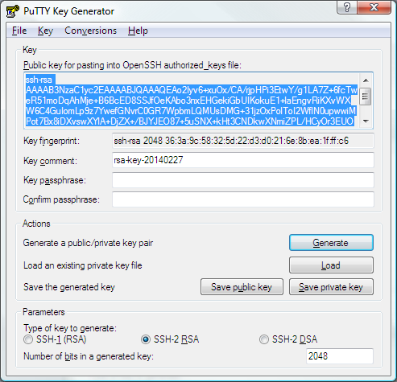

##Git setup - Duplo Media


####Basic setup

1. [Download](http://git-scm.com/downloads) and install Git for your platform

  
  Use default settings

  
  *Run Git from Command Prompt* is preferred

  
  * PuTTY's plink integrates better with Windows

  
  * Default setting is fine


2. [Download](http://www.chiark.greenend.org.uk/~sgtatham/putty/download.html) and install PuTTY, if necessary


3. Run PuTTYgen, and create or import your SSH key

  
  
  - click **Generate**
  - click **Save private key**, and store your key somewhere safe.
  
  
  - select the public key in the text area, and copy to the clipboard


4. Add the SSH key to your Springloops account
  
  - log into [Springloops](https://duplo.springloops.io) and open your profile page
  - click "edit" (top right of the page)
  - click "Profile details" in the top left menu
  - scroll down to SSH Public Key, and click "Manage"
  - click "Add a new SSH key"
  - paste in your key, and click "Create this new key"

*Optional* [Download](https://code.google.com/p/tortoisegit/wiki/Download) and install TortoiseGIT (Optional)
  - This is the easiest way to configure SSH


*Alternatively:* [Atlassian Sourcetree](http://sourcetreeapp.com)


Mac OS X : [Tower Git](http://www.git-tower.com/) both have built-in support for Git-flow


####Links

* [Getting started with git-flow](http://yakiloo.com/getting-started-git-flow/)


####Git-flow setup (Windows)

1. download [libiconv2.dll, libintl3.dll and getopt.exe](bin/linux-ng.zip) from the util-linux-ng package, and place them all in the Git bin folder (typically "C:\Program Files (x86)\Git\bin")

2. Open a Command Prompt as Administrator (right-click \> *Run as Administrator*), and clone the git-flow repo.
  - You can clone it into any directory, but keep in mind that this is the permanent home of the script files you need to use git-flow. It is not a temporary directory.

  ```
  git clone --recursive https://github.com/nvie/gitflow.git
  ```

3. Install git-flow extension

  ```
  cd gitflow
  contrib\msysgit-install.cmd
  ```


####Clone the easyad2 repo from Springloops:
  
  Open a Command Prompt, and navigate to the root of your work folder

  ```
  git clone ssh://sls@slsapp.com:1234/duplo/easyad2.git easyad
  ```


  Initialize as git-flow repository

  ```
  cd easyad
  git flow init
  ```
  Hit \<Enter\> at each prompt to accept defaults


  Done!
